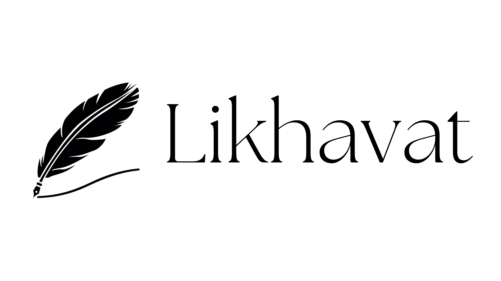
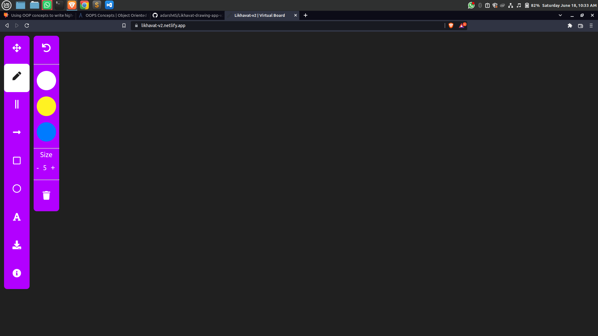

# Likhavat



## Likhavat 👨‍💻. Open, Draw, Visualize 🏠 A whiteboard application, no signup, no download, Just open & start using!

## Likhavat is a minimal yet powerful Whiteboard tool.

## This helps teachers to teach students on a virtual board in a fun and engaging manner!

[](https://app.netlify.com/sites/likhavat-v2/deploys)

[](https://github.com/adarsh45/Likhavat-drawing-app-v2) [](https://github.com/adarsh45/Likhavat-drawing-app-v2)

---

# Website - <em>[Likhavat v2](https://likhavat-v2.netlify.app/)</em>

# Features

- Pen
- Lines
- Circle
- Rectangle
- Text
- Colors

### :rocket:Glimpse :dizzy::dizzy:<br><br>

and Run the application using below commands

```
npm install		//install all react dependencies
npm start		//runserver
```

#### this will run your application in localhost:3000

### If you liked our work do give this repo a star :star::star::star: It Encourages me to do more :wink: :dizzy:
